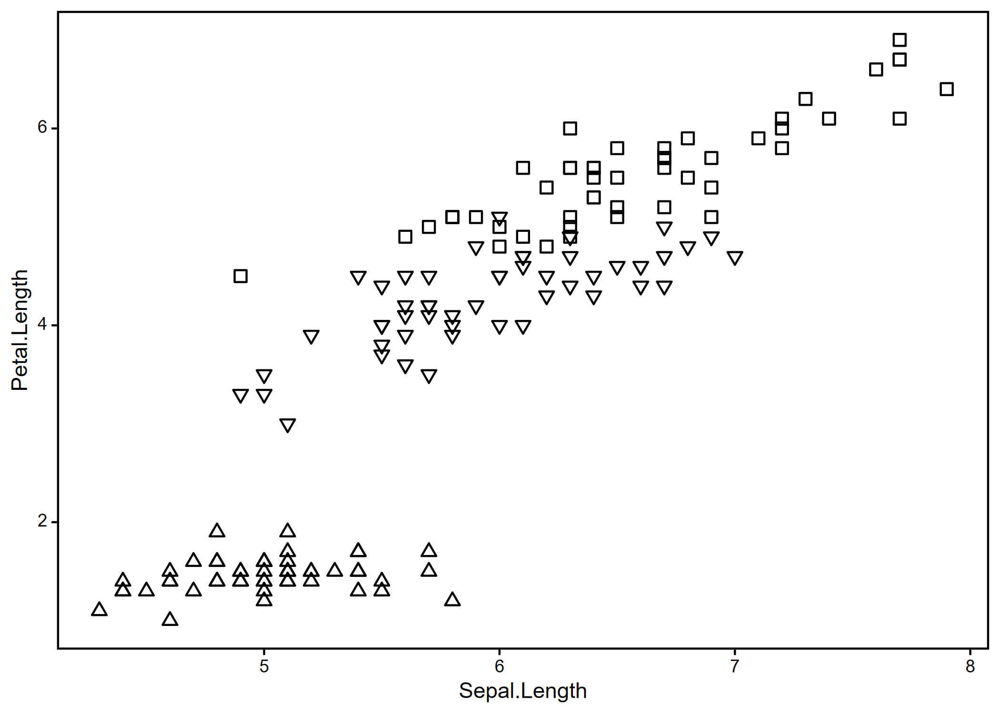

<!-- README.md is generated from README.Rmd. Please edit that file -->

# plottwist2

<!-- badges: start -->
<!-- badges: end -->

plottwist2 contains several functions to speed up the creation of neat
plots with ggplot2 and expand functionality. In particular,
`geom_symbol()` and `geom_pattern()` are intended to reduce reliance on
colour for distinguishing between groups, by adding a wider variety of
point shapes and bar textures respectively.

## Installation

You can install the development version of plottwist2 from
[GitHub](https://github.com/) with:

``` r
# install.packages("pak")
pak::pak("joepennycook/plottwist2")
```

## Example

`geom_symbol()` allows simple point shapes alongside more complex
options.

``` r
library(ggplot2)
library(plottwist2)

ggplot(data = iris, aes(x = Sepal.Length, y = Petal.Length)) +
  geom_symbol(aes(symbol = Species)) +
  scale_symbol_manual(values = c(12, 20, 28)) +
  theme_simple()
```


