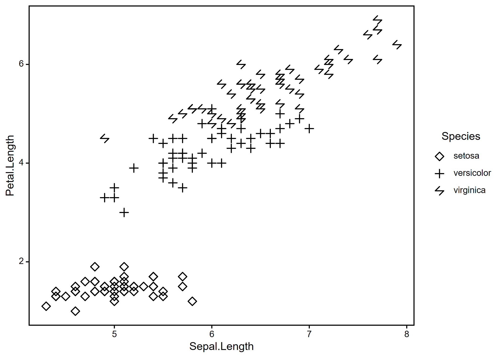

<!-- README.md is generated from README.Rmd. Please edit that file -->

# plottwist2

<!-- badges: start -->
<!-- badges: end -->

plottwist2 contains several functions to speed up the creation of neat
plots with ggplot2 and expand functionality. In particular,
`geom_symbol()` and `geom_pattern()` are intended to reduce reliance on
colour for distinguishing between groups, by adding a wider variety of
point shapes and bar textures respectively.

## Installation

You can install the development version of plottwist2 from
[GitHub](https://github.com/) with:

``` r
# install.packages("pak")
pak::pak("joepennycook/plottwist2")
```

## Example

`geom_symbol()` allows simple point shapes alongside more complex
options.

``` r
library(ggplot2)
library(plottwist2)

ggplot(data = iris, aes(x = Sepal.Length, y = Petal.Length)) +
  geom_symbol(aes(symbol = Species)) +
  scale_symbol_manual(values = c(12, 20, 28)) +
  theme_simple()
```

 A range of
symbols can be selected by supplying numeric values to the `symbol`
aesthetic.

``` r
library(ggplot2)
library(plottwist2)

ggplot(data.frame("x" = rep(1, 40),
                  "y" = rep(1, 40),
                  "symbol" = seq(40)),
       aes(x = x,
           y = x,
           symbol = symbol)) +
  geom_symbol() +
  facet_wrap(~ symbol, ncol = 8) +
  theme_simple() +
  theme(axis.text = element_blank(),
          axis.ticks = element_blank(),
          axis.title = element_blank(),
        panel.background = element_blank())
```


A range of patterns can be selected by supplying numeric values to the
`pattern` aesthetic.

``` r
library(ggplot2)
library(plottwist2)

ggplot(data.frame("x" = rep(c(0, 1), 64),
                  "y" = rep(c(0, 1), 64),
                  "pattern" = rep(seq(64), each = 2)),
       aes(x = x, y = x, pattern = pattern)) +
  geom_patch(xmin = 0, xmax = 1, ymin = 0, ymax = 1) +
  facet_wrap(~ pattern, ncol = 8) +
  theme_simple() +
  theme(axis.text = element_blank(),
        axis.ticks = element_blank(),
        axis.title = element_blank(),
        panel.background = element_blank())
```


